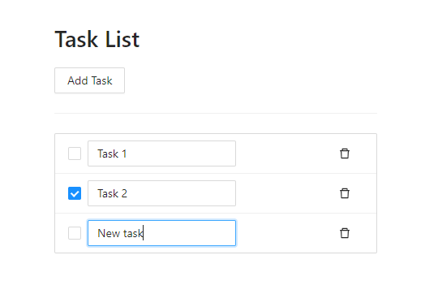

# Exercise 3 - To-do list client application

## Description
Create a to-do list app where you can add activities or reminders. Every task or activity can be marked as done, name can be changed and task can be deleted if necessary.
You can also download and run the demo application in the next chapter if it helps you better understand what the application does.

There is already a server application (REST API) for the task list that can save tasks.
The API and its manual are located at http://demo2.z-bit.ee/

The first step would be to create a user on the demo2 server with some graphical HTTP tool (Postman, Insomnia, VSC Thunder Client).
Then try to add some Tasks and check if they are saved. Only then try to make the same requests in the React client application using JavaScript.

## Client application
After playing around with API I recommend taking a template application that has basic UI code ready to use.

There are two samples available. One is made in React framework, another is made in vanilla JavaScript.  
Vanilla means it doesn't use any framework, no need to install anything, just open index.html and it works.
This one it might be easier to understand at first, but not so convenient for larger projects.

- [React example](https://github.com/timotr/harjutused/tree/main/hajusrakendused/todo-frontend-react)
- [Vanilla JS](https://github.com/timotr/harjutused/tree/main/hajusrakendused/todo-frontend-vanilla)

Right now in those templates everything works until you refresh the page - you'll see nothing is saved.
You need to add HTTP requests into the code, which would send the data to the backend server when users changes tasks.
For example, the delete button would send a message to the server with an HTTP request that the selected task should be deleted.

If example doesn't suit you, you can build a client application yourself on a suitable platform or even as a command line application.
One of the bonuses of distributed applications is that it doesn't matter what language you write the application in, you can still make them communicate.
You can build the client application (front-end) yourself, but you cannot build the server application (back-end) yourself in this task - we have to use the existing one.

In order to solve the task, you have to ask the teacher additional questions, the description deliberately does not contain all the information.

## Assessment
- Grade 3 Create, read and update tasks (CRUD) are mirrored in demo2 server, but API token is hard-coded and user can't be changed in UI
- Grade 4 In addition to the previous one, you can log in and out with an existing user
- Grade 5 In addition to the previous one, you can also register a new user

## What I expect you to already know:
- How to install and run Javascript applications
- How to make HTTP requests
- How to set HTTP request headers, query parameters and body data
- Loops and data structures in choosen language

## What you might need to learn:
- RESTful API structure: methods and URL format
- What are cookies
- How to store session tokens in sessionStorage or localStorage
- What are debounce and throttle functions
- About CORS when using Chrome
- Navigate in React application, how to use functional components and React Hooks https://beta.reactjs.org/

## How to submit
This work may be too large to submit in Teams, it is recommended to upload the application to GitHub and submit only the repository address in Teams.
